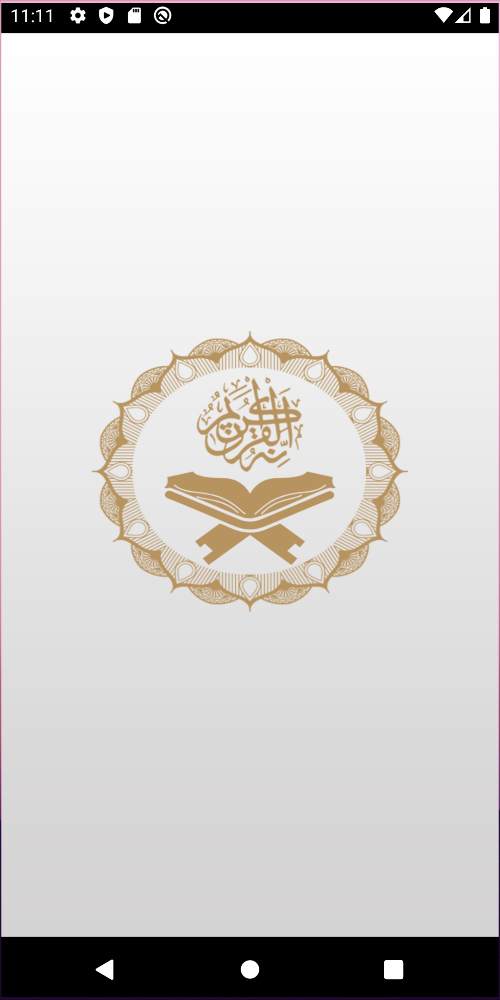
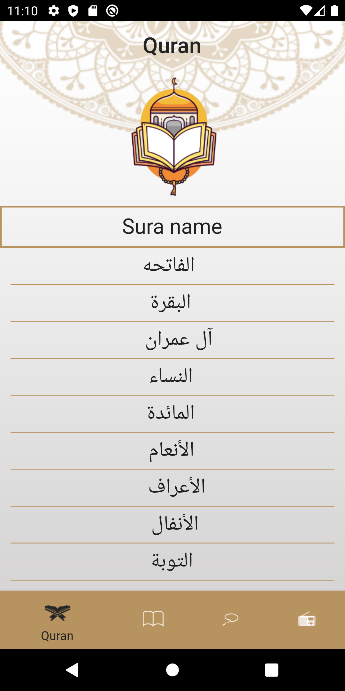
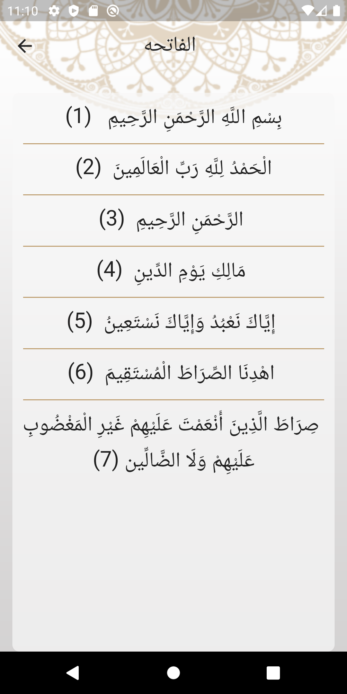
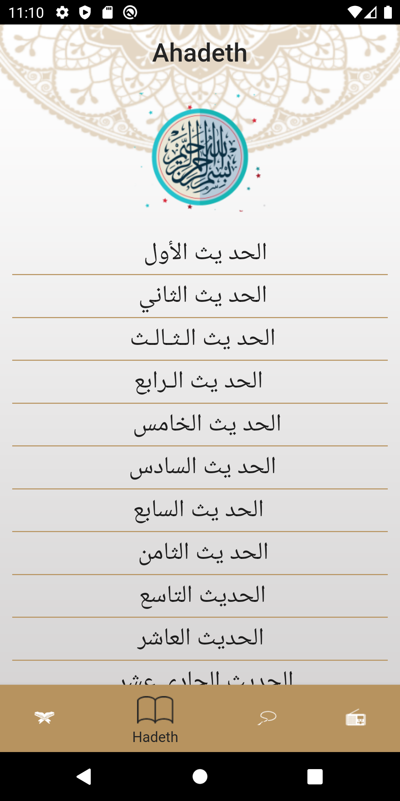
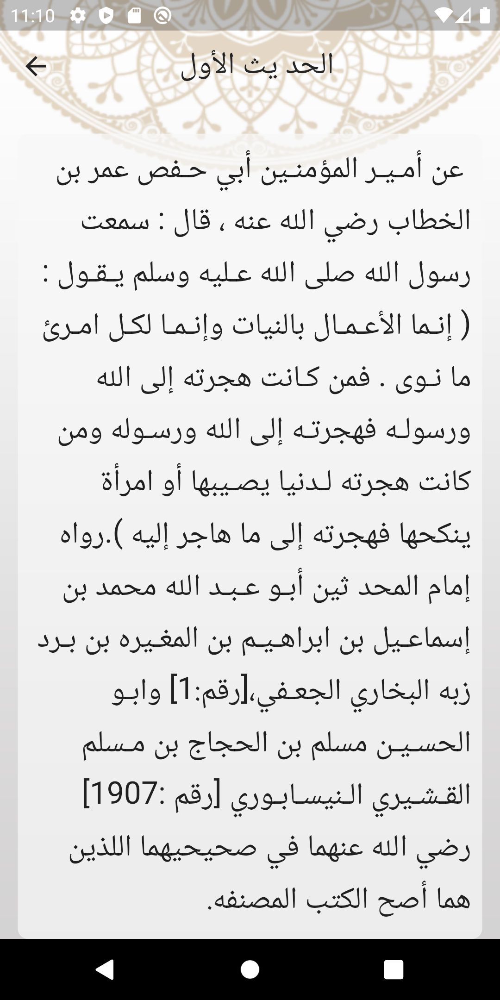
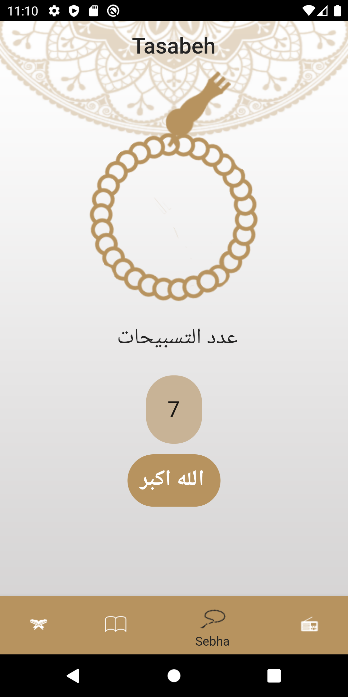
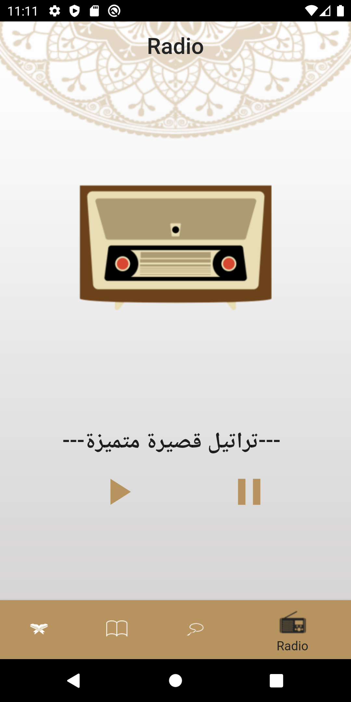

# islami_app

A Flutter App that allow Users to read Quran, Ahadeth and listen to Quran Radio .

## Tools

- Local Data
- Radio API

## Package

- Networking: HTTP
- Audio Players

## Video

## Screenshoots

<table>
  <tr>
    <td>Splash Screen</td>
    <td>Quran Screen</td>
     <td>Sura Details Screen</td>
  </tr>
  <tr>
    <td></td>
    <td></td>
    <td></td>
  </tr>
 </table>
      
<table>
  <tr>
    <td>Ahadeth Screen</td>
     <td>Ahadeth Details Screen</td>
     <td>Tasabeh Screen</td>
  </tr>
  <tr>
    <td></td>
    <td></td>
    <td></td>
  </tr>
 </table>
 
 
 <table>
  <tr>
    <td>Radio Screen</td>
  </tr>
  <tr>
    <td></td>
  </tr>
 </table>
